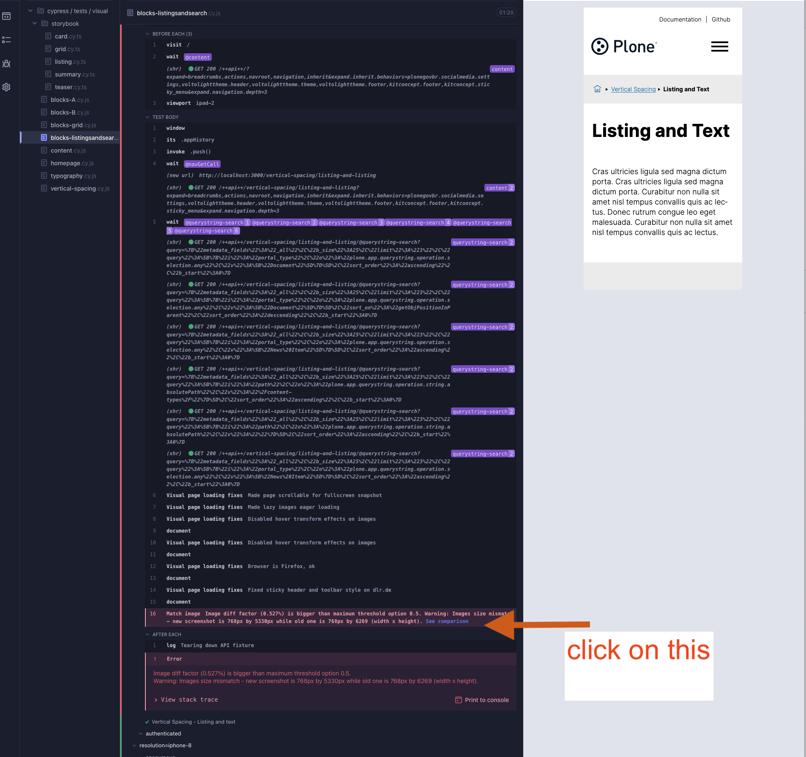

# How to run Visual Regression Tests

Follow these steps to run visual regression tests:

1. Start the backend

   ```shell
   make backend-start
   ```

2. Start the frontend

   ```shell
   cd frontend
   make acceptance-frontend-prod-start
   ```

3. Run Cypress for visual testing

   ```shell
   cd frontend
   make acceptance-test-visual
   ```

---

## How to Review and Update Visual Test Results

When you run visual regression tests, some tests might fail if there are visual differences between the current UI and the baseline snapshots.

### Steps to Review

1. After the test completes, look for the **"See comparison"** link in Cypress.
1. Click the link to compare the **baseline screenshot** and the **newly captured screenshot**.
1. If the changes are expected and correct, you can update the baseline screenshots accordingly.

### Screenshot

Below is an example screenshot showing the Cypress visual test comparison:



### Screencast

Watch the screencast to learn how to compare and update visual tests:

<video controls="True" preload="auto"><source src="../_static/visual.mp4" type="video/mp4">Visual Regression Tests Screencast</video>
