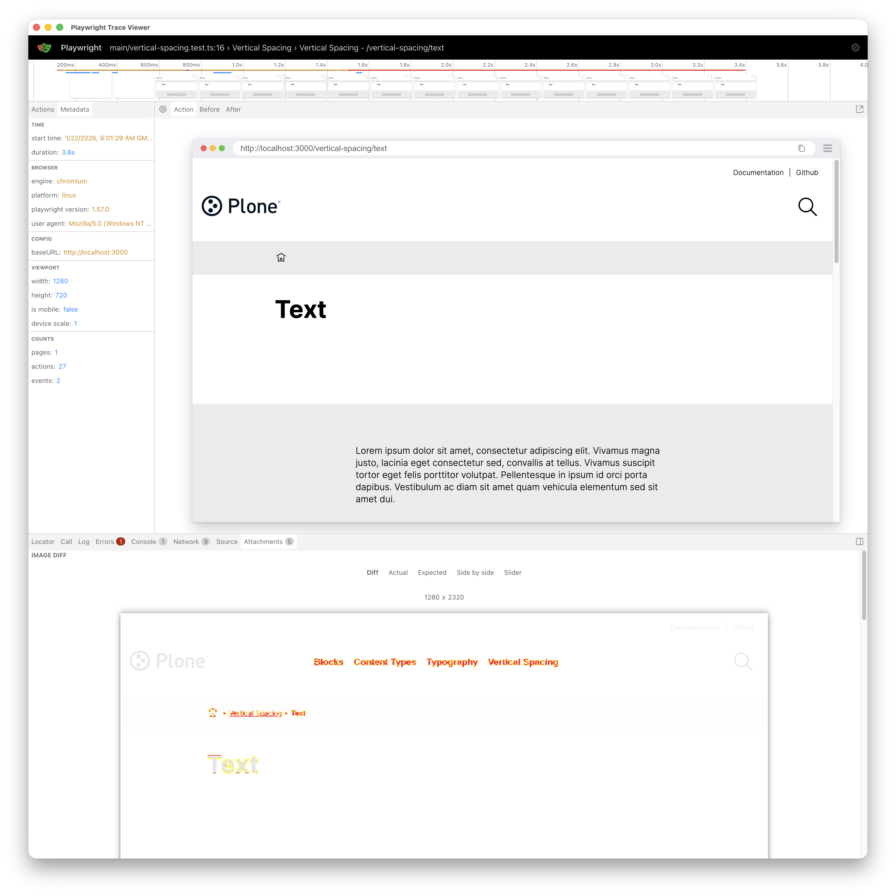

# Visual regression tests

This chapter describes how to run visual regression tests with Playwright.


## Workflow

VLT has a set of visual regression tests implemented using [Playwright](https://playwright.dev/).
We use these tests to ensure that visual aspects of the application remain consistent over time and that the UI is resilient to regressions caused by unintended changes while developing new features or fixing bugs.

VLT CI runs visual regression tests on every pull request to the main branch.

VLT has two types of visual regression tests:
- Volto Visual Regression Tests: these tests cover the main Volto application, including common components, blocks and pages.
- Storybook Visual Regression Tests: these tests cover the Storybook stories, ensuring that individual components render correctly.

Normally, you don't need to run visual regression tests locally, as they are executed in the CI environment.
Whenever a visual regression test fails in CI, you can review the results, fix the regressions and/or update the baseline screenshots if necessary.

When a visual regression test fails, the CI job generates artifacts that you can download to review the visual differences and decide whether to accept the changes or fix the issues.

## How to Review and Update Visual Test Results

```{note}
In the previous incarnation of the visual regression tests, we used Cypress and we saved the screenshots in development time.
However, this approach had some drawbacks, since CI might have different rendering results than local machines because of different OS, browser versions, fonts, etc.
Therefore, we switched to a CI-only based approach using Playwright, where the screenshots are generated and compared only in the CI environment.
You can still develop, run and review visual regression tests locally using Playwright's UI mode (or headless mode).
```

```{important}
Make sure that your branch is up to date with the `main` branch before running visual regression tests, as other PRs might have updated the baseline screenshots.
An outdated branch might lead to false positives or conflicts when updating the baseline screenshots.
```

Typically, the development workflow will be as usual, and eventually, you might run into visual regression test failures in CI.
After that, you can download the artifacts from the CI run.
Once downloaded, extract the artifacts zip into a folder in your computer.
One of this artifacts is `trace.zip`.
You can open it using Playwright's test runner UI to review the visual differences.
A video is also available in the artifact to see how the test ran in CI.

### Opening a Playwright Trace Locally (`trace.zip`)

1. Download the artifact from the CI job.
2. Run this command in the `frontend` folder:

   ```shell
   pnpm exec playwright show-trace path/to/trace.zip
   ```

3. This will open a window, where you can review the trace results and check the visual differences inside the Playwright Test Runner UI.



At the top left, you can see the metadata of the test run.
On the center there is the screenshot taken during the test run.
At the bottom, there's a menu where you can select the different tabs from the browser, and other specific data.
At the very bottom, you can see a list of tabs for selecting the different screenshots taken during the test run, and specifically:
- Diff: shows the differences between the baseline and the new screenshot.
- Actual: shows the newly captured screenshot.
- Expected: shows the baseline screenshot.
- Side by side: shows both screenshots side by side for easier comparison.
- Slider: shows both screenshots with a slider to compare them interactively by dragging the slider left and right.

### Updating Baseline Screenshots

If you have reviewed the visual differences and determined that the new screenshots are correct (i.e., the changes are intentional and acceptable), you can update the baseline screenshots.

To do this, follow these steps:

1. Go to Github actions tab in VLT repository.
2. Use the workflow `Update VRT Screenshots` or `Update VRT Screenshots Storybook` depending on which screenshots you want to update.
3. Click on the `Run workflow` dropdown and select the `main` branch.
4. Click the green `Run workflow` button.

The workflow will run and update the screenshots repository with the new baseline screenshots.
Run the visual regression tests again in your PR to ensure that everything is passing with the updated screenshots.

```{warning}
Once updated, merge the PR as soon as possible to avoid conflicts with other ongoing PRs.
```

## How to Run Visual Regression Tests Locally

### Prerequisites for Visual Regression Tests

The screenshots directory contains the baseline screenshots used for comparison during the visual regression tests and it is stored in a separate git repository.
It is checked out into `frontend/playwright/__screenshots__`.
You can also set up the visual regression tests manually by following these steps:

```shell
make sync-visual-regression-snapshots
```

```{note}
The commands of the sections below setup the visual regression tests (by running the aforementioned command) and checking out the screenshots repository and configuring the test environment before running the tests.
```

### Volto Visual Regression Tests

The tests can also be run locally while developing new features or fixing bugs.
These are the steps to run visual regression tests for Volto.

Follow these steps to run visual regression tests:

1. Start the backend

   ```shell
   make backend-start
   ```

2. Start the frontend

   ```shell
   make acceptance-visual-frontend-prod-start
   ```

3. Run Playwright for visual testing

   ```shell
   make acceptance-visual-test
   ```

alternatively, you can run Playwright visual tests, narrowing down to an individual test file, e.g., `playwright/tests/visual/main/blocks.test.ts`:

```shell
pnpm exec playwright test playwright/tests/visual/main --ui
```

## Storybook Visual Regression Tests

We have a infrastrucure for visual regression testing in Storybook stories.
In this case, the setup is a bit different, as we need to start Storybook (instead of Plone/Volto) first.
You can also run visual regression tests for Storybook:

1. Build and Run Storybook

   ```shell
   make storybook-build
   make storybook-start
   ```

2. Run Playwright for visual testing Storybook

   ```shell
   make acceptance-visual-test-storybook
   ```

### Screencast

Watch the screencast to learn how to compare and update visual tests:

<video controls="True" preload="auto"><source src="../_static/visual.mp4" type="video/mp4">Visual Regression Tests Screencast</video>
