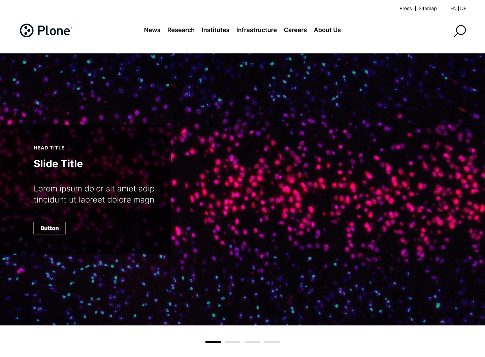

# Volto Light Theme by kitconcept

[](https://www.npmjs.com/package/@kitconcept/volto-light-theme)
[](https://github.com/kitconcept/volto-light-theme/actions)
[](https://github.com/kitconcept/volto-light-theme/actions)
[](https://github.com/kitconcept/volto-light-theme/actions)


## Vision

The main vision of the Volto Light Theme (a.k.a VLT) is to serve as a foundation for kitconcept's future projects, following the release of Plone 6.
It contains the feedback from the company's last years projects and the success stories in the UI/UX side.
It aims to be future proof, so it has to be aligned with the upcoming Volto and Plone 7 vision in terms of theming strategy decided by the Plone community.



## Requirements and specs

### It should not use any SemanticUI component or styling

SemanticUI as default design component system is deprecated in Volto 18 and will be removed in Plone 7.
In preparations for this, VLT is not using any SemanticUI component, nor any related styling (`.ui.XXX`).

Plone 7 strategy is:

- Provide a very basic and structural vanilla components to build upon theming and CMSUI as well ([`@plone/components`](https://github.com/plone/volto/tree/main/packages/components))
- These components will be based in a headless component system [React Aria Components](https://react-spectrum.adobe.com/react-aria/components.html)
- Volto projects can be themed using `@plone/components` as baseline or use a complete different design or component system of the developer/integrator choice.

### Volto components shadowing (`customizations`) use case and best practice

If possible, we will switch to SemanticUI-less components when `@plone/components` is ready.
Specially if the elements that we are customizing are clearly "theme" (eg. header/footer, etc).
In the case of other Volto customizations that are not clear part of the theme (eg. Search block), it's fine to stick using what the original is using (SemanticUI).
When Volto will make the switch in the future, we should then adapt all the customizations to match the one in the Volto core.
The approach used is to use a proxy to a component of the `components` folder.
This way it's easier to keep track of changes, and another add-on can customize again the light theme component, not the original Volto customization.

### It should use kitconcept's layout used in FZJ/DLR projects

Since FZJ/DLR projects we've been trying a new concept in layout for Volto.
This new layout uses three widths for the content elements:

- Narrow (text)
- Default (blocks)
- Layout (main screen elements like Header, Footer)

The Layout sized elements snap to 1440px. The breakpoints are also different than default Volto.
This new layout uses mixin's and CSS that can be found in `layout.less` in the theme folder.
It leverages container queries for managing the layout styling.

### Organization of the files

We will start organising the files in the root of `theme` folder, to differentiate from a normal "SemanticUI" theme.
Take a look at the current state.
We will follow this convention:

- One file per component/block
- Use the Volto theme facility using the SCSS scape hatch provided so other add-ons can hook to it.
- The styling is centralized in `main.scss`, the rest of the files are loaded from there.

## Why a headless component system?

https://medium.com/@nirbenyair/headless-components-in-react-and-why-i-stopped-using-ui-libraries-a8208197c268

## Vertical spacing block model (v2)

This theme has the concept of block "grouping" given two consecutive blocks with the same styling block wrapper property `backgroundColor`.
You have to add this property to your blocks in your blocks code. This add-on customizes `RenderBlocks.jsx` component in order to do so.

The wrappers have the classnames `blocks-group-wrapper` and the name of the background color, eg. `grey`, defaulting to `transparent` if no `backgroundColor` property is set in the styling block wrapper in the block.

**Disclaimer**: This might change in the near future, since we are developing a new integral Block Model for VLT and Volto.

### Vertical spacing rules

These main rules spec applies to the theme:

- On each change of color, a vertical padding (both `padding-bottom` and `padding-top`) of `80px` defined with the main variable `$color-block-change-vertical-spacing`.
- The default bottom margin is defined with the main variable `$block-vertical-space` and set by default to `25px`.
- [grid] Vertical spacing for grids should be `80px` for both top and bottom, even if the previous and next blocks are of the same color.
- [grid+grid] When two grids happen side by side and are of the same color. It should be equal to the grid gap, so it's set to `@gutterWidth` and currently `1rem`.
  It has to be adjusted with a bit of negative margin to cancel the current inner padding in grid cells.
- [grid+grid] Grids columns belonging to the same grid and same color in small mobile viewports.
  They should be closer to match the other adjacent ones, so they seem to belong to the same grid set.
- [footer] The footer has a top vertical spacing of `80px`.
- [teasers] The last teaser, except if the following is a button, does NOT have a line at the bottom.
- [listing] The last listing, except if the following is a button, does NOT have a line at the bottom.
- [listing] After two consecutive listings, the vertical spacing should be `200px`.
- [text+button] If there's a text and a button, then the vertical spacing betweeen them is `60px`.
- [image+separator-block] If after image comes a separator block, the vertical spacing between them is `40px`.

### Media queries vs container queries

We use media queries when the styling it's generic enough to apply only to the View.

We use container queries when do care explicitly about how the styling is being applied in edit mode as well and we want the content area to behave 1:1 with the view mode.

Reason: The container queries allow us to abstract the width from the sidebar and toolbar in edit mode, showing the content area as it will be in that size, in view mode.

**Remember**: The margins in responsive are being taken care with container queries in `layout.scss`.
So everything related to that, goes like it works in there, with container queries. See implementations for details in case you need it.

## Specification

`@kitconcept/volto-light-theme` works with the following Plone Blocks:

- Grid-Block (https://www.npmjs.com/package/@kitconcept/volto-blocks-grid)
- Teaser-Block (https://www.npmjs.com/package/@kitconcept/volto-blocks-grid)
- Slider-Block (https://www.npmjs.com/package/@kitconcept/volto-slider-block)
- Button-Block (https://www.npmjs.com/package/@kitconcept/volto-button-block)
- Separator-Block (https://www.npmjs.com/package/@kitconcept/volto-separator-block)
- Heading-Block (https://www.npmjs.com/package/@kitconcept/volto-heading-block)
- Introduction-Block (https://www.npmjs.com/package/@kitconcept/volto-introduction-block)
- Accordion-Block (https://www.npmjs.com/package/@eeacms/volto-accordion-block)

and the following add-ons:

- DSGVO-Banner (https://www.npmjs.com/package/@kitconcept/volto-dsgvo-banner)

## Block Model v3

We are working at the same time in a new spec for blocks: [The Block Model v3](./block-model-v3.md).


```{toctree}
:maxdepth: 1
install
feature-flags
contributing
upgrade-guide
block-model-v3
compatibility
releases
```
