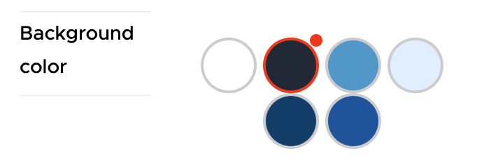
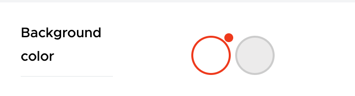
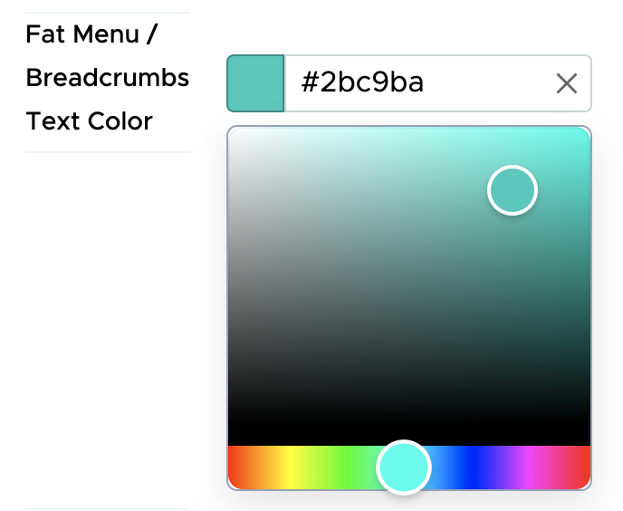
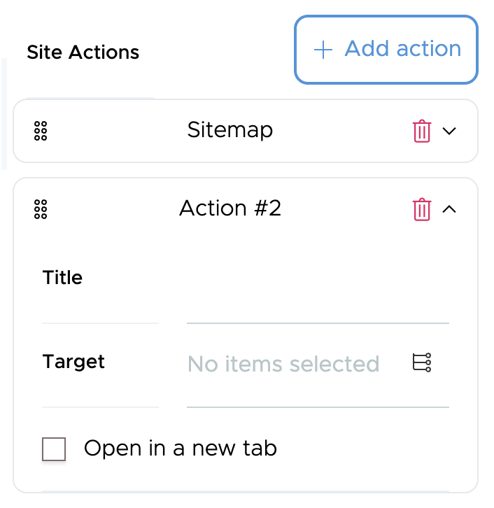
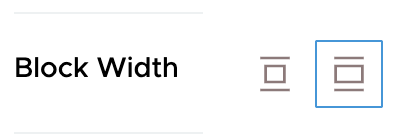
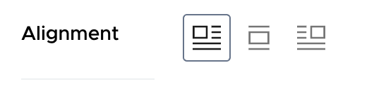
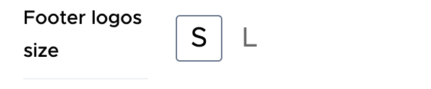

# Widgets

VLT provides a set of widgets that provide structural features.

## `themeColorSwatch`

Used for choosing a configured theme color (stored in `config.blocks.themes`).
Uses the {file}`/src/components/widgets/ThemeColorSwatch` component.



## `color_picker` (Volto widget override)

Semantic UI-free version of the Volto widget `color_picker`.
Given an user defined array of color definitions, it allows you to choose one of them.
Uses the {file}`/src/components/widgets/ColorSwatch` component.



## `colorPicker`

A color picker with an RGB visual color chooser, and a `hex` color field.
Uses the {file}`/src/components/widgets/ColorPicker` component.



## `blocksObject`

The `blocksObject` widget is similar in functionality to Volto's `ObjectListWidget`, as configured in `config.widgets.widget.object_list`.
It allows to introduce a list of ordered objects with the same shape.
It allows to reorder them using drag and drop.
It uses `@plone/components`.



This widget saves its contents in Volto's standard blocks format, using the `blocks_layout` and `blocks` keys.
This allows the standard serializers and deserializers to work with the object schema fields.
The shape of the objects it contains is defined by either the `schema` or `schemaName` props.

If `schemaName` is provided, you should register a schema as a utility in the following form.

```ts
  config.registerUtility({
    name: 'footerLogos',
    type: 'schema',
    method: footerLogosSchema,
  });
```

`footerLogosSchema` is a schema generation function or a plain `JSONSchema` object that has the following signature.

```ts
export type BlocksObjectWidgetSchema =
  | (JSONSchema & { addMessage: string })
  | ((props: BlocksObjectWidgetProps) => JSONSchema & { addMessage: string });
```

Alternatively, you can provide the schema generation function or the plain `JSONSchema` using the `schema` prop and wrapping it around a custom widget.

Internally it stores data using the `blocks` and `blocks_layout` keys, so it uses the standard blocks serializer machinery.
It uses the {file}`/src/components/widgets/BlocksObject` component.

The following snippet shows the shape of the types of the component.

```ts
export type BlocksObjectWidgetProps = {
  /**
   * The ID of the widget.
   */
  id: string;
  /**
   * The ID of the block this widget belongs to.
   */
  block: string;
  /**
   * The fieldset this widget belongs to.
   */
  fieldSet: string;
  /**
   * The title of the widget.
   */
  title: string;
  /**
   * The current value of the widget, which is BlocksData.
   */
  value?: BlocksData;
  /**
   * The default value for the widget. Can be a string or an object.
   */
  default?: string | object;
  /**
   * Whether the widget is required.
   */
  required?: boolean;
  /**
   * The value to use when the widget is missing a value.
   */
  missing_value?: unknown;
  /**
   * The CSS class name for the widget.
   */
  className?: string;
  /**
   * A callback function that is called when the value of the widget changes.
   * @param id The ID of the widget.
   * @param value The new value of the widget.
   */
  onChange: (id: string, value: any) => void;
  /**
   * The index of the currently active object.
   */
  activeObject: number;
  /**
   * A callback function that is called to set the active object.
   * @param index The index of the object to set as active.
   */
  setActiveObject: (index: number) => void;
  /**
   * The schema for the BlocksObjectWidget.
   */
  schema: BlocksObjectWidgetSchema;
  /**
   * The name of the schema.
   */
  schemaName: string;
  /**
   * An optional function to enhance the schema.
   * @param args An object containing the schema, form data, intl, navRoot, and contentType.
   */
  schemaEnhancer?: (args: {
    schema: JSONSchema & { addMessage: string };
    formData: BlockConfigBase;
    intl: IntlShape;
    navRoot: Content;
    contentType: string;
  }) => JSONSchema;
};
```

It's worth mentioning that the `activeObject` and `setActiveObject` props allow you to set and synchronize the active and uncollapsed object of the widget from the outside.

## Buttons component

This component is a helper for building widgets that have a list of buttons that can be toggled in order to select a single value.
It is not a widget on itself, but it allows other widgets to build up using its base functionality.
You can pass as props a configurable list of buttons, with a configurable list of actions that each button has assigned.
You can configure the icons and the i18n message used for each button as well.

```ts
type Actions =
  | {
      name: string;
      label: string;
      style: Record<`--${string}`, string>;
    }
  | {
      name: string;
      label: string;
      style: undefined;
    };

/**
 * A tuple that has an icon in the first element and a i18n string in the second.
 */
type ActionInfo = [React.ReactElement<any>, string];

export type ButtonsWidgetProps = {
  /**
   * Unique identifier for the widget.
   */
  id: string;

  /**
   * Callback function to handle changes.
   */
  onChange: Function;

  /**
   * List of actions available for the widget.
   */
  actions: Actions[];

  /**
   * Map containing additional the information (icon and i18n string) for each action.
   */
  actionsInfoMap: Record<string, ActionInfo>;

  /**
   * List of actions to be filtered out. In case that we don't want the default ones
   * we can filter them out.
   */
  filterActions: string[];

  /**
   * Current value of the widget.
   */
  value: string;

  /**
   * Default value of the widget.
   */
  default: string;

  /**
   * Indicates if the widget is disabled.
   */
  disabled: boolean;

  /**
   * Indicates if the widget is disabled (alternative flag for compatibility reasons).
   */
  isDisabled: boolean;
};
```
## `blockWidth`

A widget to select a width from the defined `config.blocks.widths`.
Uses the {file}`/src/components/widgets/BlockWidth` component.



## `blockAlignment`

A widget to select the block alignment, one of either `left`, `right`, or `center`.
It's based on the {file}`/src/components/widgets/Buttons` component under the hood, so the actions and the styles to be applied are configurable.
It uses the {file}`/src/components/widgets/BlockAlignment` component.



## `size`

A widget to select the block size from a default list of values, one of either `small`, `medium`, or `large`.
It's based on the {file}`/src/components/widgets/Buttons` component under the hood, so the actions and the styles to be applied are configurable.
It uses the {file}`/src/components/widgets/Size` component.


