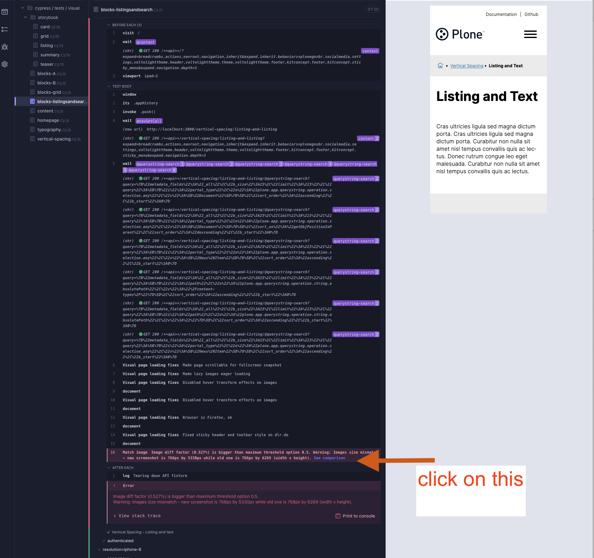

# Testing Guide

This document provides detailed instructions on how to run different types of tests in the project, including block acceptance tests, accessibility (a11y) tests, and visual regression tests. It also explains how to review and update visual test results.

---

## ✅ How to Run Block Acceptance Tests

Follow these steps to run the block acceptance tests:

1. **Start the backend for acceptance testing**

   ```bash
   make acceptance-backend-dev-start
   ```

2. **Start the frontend for acceptance testing**

   ```bash
   make acceptance-frontend-dev-start
   ```

3. **Open Cypress in the browser**

Run the following command to open Cypress and execute the acceptance tests:

   ```bash
   make acceptance-test
   ```

---

## ✅ How to Run Accessibility (a11y) Tests

Follow these steps to run accessibility tests using Cypress:

1. **Start the backend**

   ```bash
   make backend-start
   ```

2. **Start the frontend**

   ```bash
   cd frontend
   make acceptance-frontend-prod-start
   ```

3. **Run Cypress for accessibility testing**

   ```bash
   cd frontend
   make acceptance-a11y-test
   ```

---

## ✅ How to Run Visual Regression Tests

Follow these steps to run visual regression tests:

1. **Start the backend**

   ```bash
   make backend-start
   ```

2. **Start the frontend**

   ```bash
   cd frontend
   make acceptance-frontend-prod-start
   ```

3. **Run Cypress for visual testing**

   ```bash
   cd frontend
   make acceptance-test-visual
   ```

---

## ✅ How to Review and Update Visual Test Results

When you run visual regression tests, some tests might fail if there are visual differences between the current UI and the baseline snapshots.

### Steps to Review

1. After the test completes, look for the **"See comparison"** link in Cypress.
2. Click the link to compare the **baseline screenshot** and the **newly captured screenshot**.
3. If the changes are expected and correct, you can update the baseline screenshots accordingly.

### Screenshot

Below is an example screenshot showing the Cypress visual test comparison:



### Screencast

📽️ Watch the screencast to learn how to compare and update visual tests:


---
